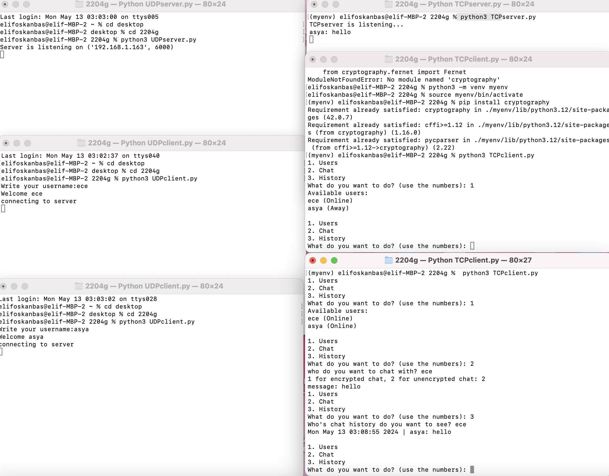
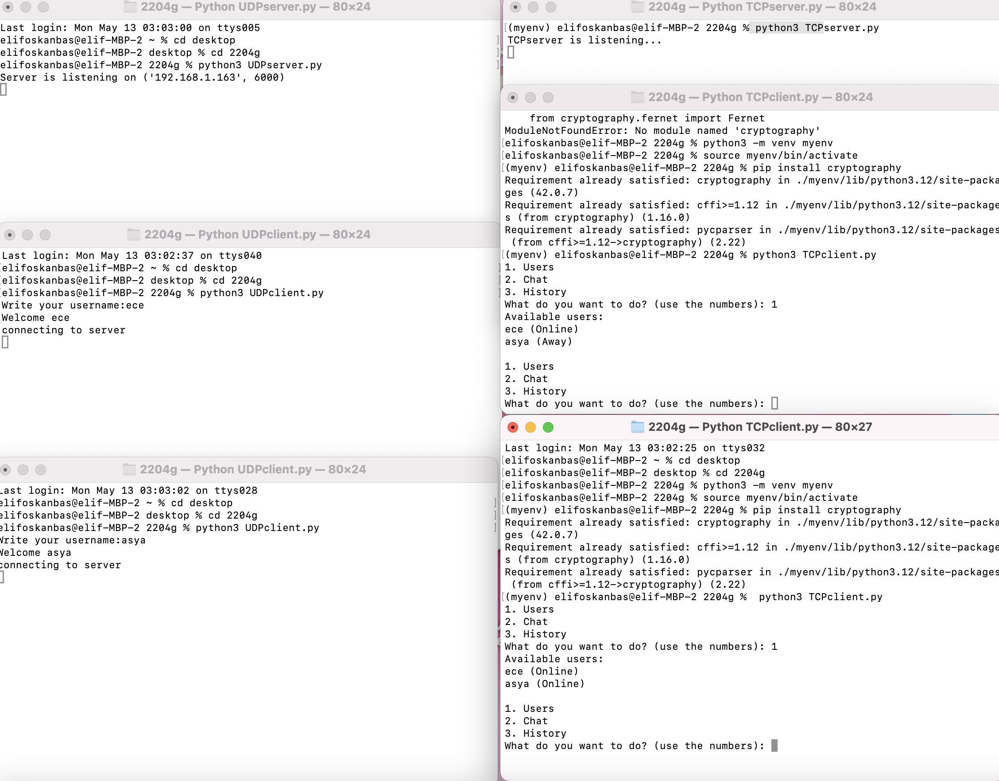
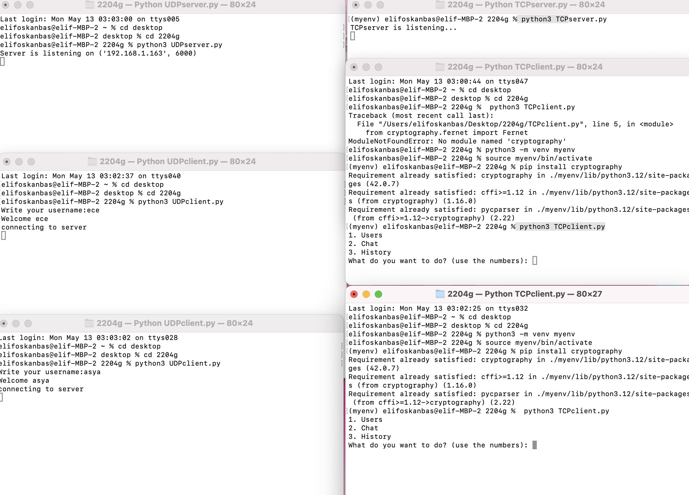

# SecureChat-TCP-UDP
Python-based chat application implementing both TCP and UDP protocols for real-time communication. Includes features like user availability via UDP broadcasting, encrypted messaging with Diffie-Hellman and Fernet, and chat history logging. Designed for learning and demonstration of socket programming and secure communication.
# Chat Application with TCP and UDP

This is a Python-based chat application that demonstrates communication over TCP and UDP protocols. The application includes both server and client implementations for each protocol, allowing for encrypted and unencrypted communication.

## Features
- **TCP Server and Client**: Supports secure and unsecure messaging.
- **UDP Server and Client**: Enables broadcast messages to discover active users.
- **Encrypted Communication**: Uses the Diffie-Hellman algorithm and `cryptography.fernet` for encryption.

## File Structure
- `TCP/TCPserver.py`: Handles incoming TCP connections and manages secure communication.
- `TCP/TCPclient.py`: Initiates TCP communication with a selected user.
- `UDP/UDPserver.py`: Manages broadcasting and user availability.
- `UDP/UDPclient.py`: Periodically announces user presence.
- `logs/`: Stores chat logs for each user.
- `data.json`: Keeps track of active users and their status.
- `username.json`: Stores the local user's username.

## How to Run
1. Start the UDP server:
   ```bash
   python UDP/UDPserver.py
## How It Works
The program processes a log file, extracts useful information, and saves the top 10 most accessed files. Below is an example output:





